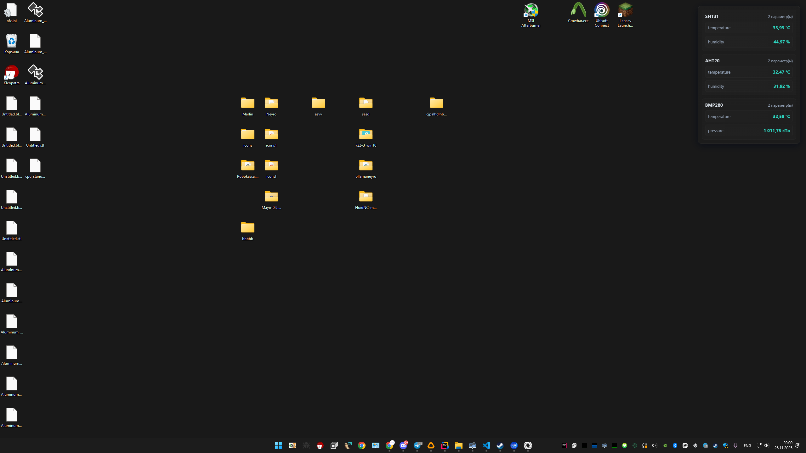
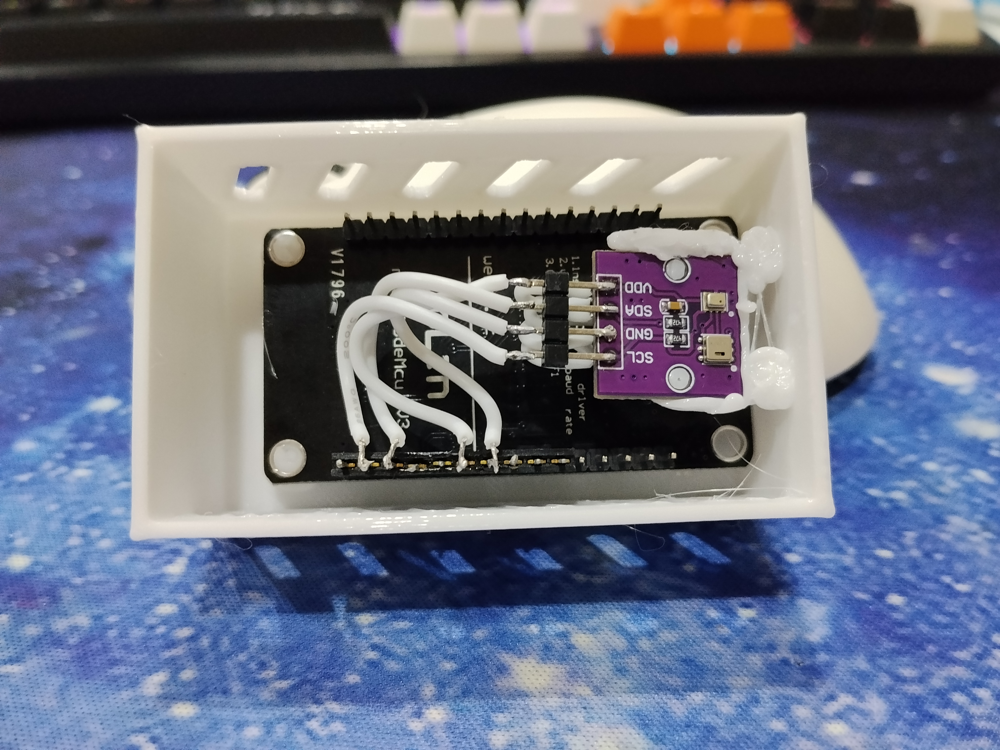

## ESP web API and web panel

Project: Web API and web panel for ESP (NodeMCU v2) with support for temperature, humidity, and pressure sensors.




### Hardware and supported sensors
- TZT AHT20+BMP280 — temperature, humidity, and air pressure sensor for Arduino  
- TZT SHT31 — temperature and humidity sensor

### platformio.ini
```ini
[env:nodemcuv2]
platform = espressif8266
board = nodemcuv2
framework = arduino
monitor_speed = 115200
lib_deps = 
	bblanchon/ArduinoJson@^7.4.2
	adafruit/Adafruit SHT31 Library@^2.2.2
	adafruit/Adafruit AHTX0@^2.0.5
	adafruit/Adafruit BMP280 Library@^2.6.8
	underkogit/HtmlMinifier
```

### Resources
- HtmlMinifier: https://github.com/underkogit/HtmlMinifier